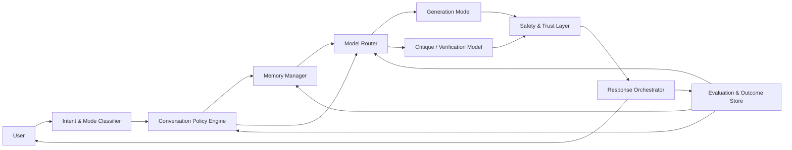

# Quantora Communication Layer Blueprint

## Purpose

Quantora should become a **communication intelligence platform**, not a thin wrapper around foundation models. The Communication Layer is the system that decides how Quantora listens, remembers, guides, protects, routes, and improves. It is the product moat.

The user intent behind Quantora is clear:

- help talented, curious people turn ideas into outcomes
- reduce friction between imagination and execution
- make guidance feel human, calm, practical, and trustworthy
- create a system that can operate across domains such as travel, education, research, and financial guidance without becoming reckless or generic

This document turns that intent into a concrete architecture and rollout plan.

## Product thesis

The winning product is not "the app with the smartest base model."

The winning product is the one that:

1. understands what the user is truly trying to achieve
2. responds with the right level of depth, initiative, and caution
3. remembers only what is useful and consented
4. routes work to the right model and tool at the right time
5. learns from outcomes, not just prompts
6. protects the user when stakes are high

That is the Quantora Communication Layer.

## The six subsystems

### 1. Intent and mode classifier

This subsystem decides what kind of interaction is happening.

Outputs:

- `domain`: general | travel | education | finance | coding | research | wellness
- `mode`: ask | plan | build | compare | decide | review | act
- `stakes`: low | medium | high
- `autonomy`: answer_only | recommend | draft | act_with_confirmation
- `tone`: exploratory | urgent | anxious | decisive | reflective

Implementation guidance:

- keep a fast heuristic first-pass classifier in code for cheap/common cases
- use a low-latency model only when intent is ambiguous
- persist the classifier output as structured metadata on each meaningful turn

Recommended models:

- Gemini Flash for fast classification and multimodal input understanding
- a lower-cost structured JSON model for fallback transforms
- a future distilled routing model trained on Quantora outcomes

### 2. Conversation policy engine

This is the heart of the product.

The policy engine decides:

- whether to ask a clarifying question or proceed
- when to challenge assumptions
- when to summarize versus dive deep
- when to defer action until evidence is stronger
- how much empathy, structure, and initiative to apply
- when to refuse or redirect

This should be mostly deterministic, with model assistance used only where ambiguity or tone quality matters.

Core policy principles:

1. one strong clarifying question is better than many weak ones
2. match depth to the user's energy and objective
3. prefer options and trade-offs to one-sided answers
4. slow down when stakes increase
5. never present simulation as execution
6. do not overstate certainty in finance, health, or legal-like guidance

### 3. Layered memory system

Quantora should not treat memory as a raw transcript dump.

Use five layers:

1. **turn memory**  
   Temporary state used for the active exchange.

2. **working memory**  
   Current goal, open questions, constraints, pending decisions.

3. **durable preference memory**  
   User likes concise responses, prefers step-by-step plans, travels with family, is budget-sensitive, learns visually, etc.

4. **outcome memory**  
   What the user accepted, rejected, completed, ignored, or had to fix later.

5. **domain memory**  
   Reusable templates and known good flows for travel, education, finance, research, and product-building.

Memory rules:

- all durable memory must be typed and consented
- model-authored memory must not be treated as ground truth without confidence and provenance
- memory retrieval should prefer concise structured facts over transcript replay

### 4. Model routing and ensemble orchestration

Quantora should not ask one model to do everything.

Routing policy should consider:

- stakes
- latency target
- domain
- required output shape
- whether multimodal understanding is needed
- whether grounding or critique is required

Suggested role split:

- **Gemini Flash**: intake, multimodal understanding, first-pass response, classification
- **strong reasoning model**: high-stakes planning, synthesis, critique, grounded recommendations
- **smaller structured model**: JSON extraction, normalization, lightweight transforms
- **future specialized models**: travel itinerary optimization, learning-plan adaptation, finance research summarization

Routing pattern:

1. fast first response
2. escalate only if:
   - stakes are high
   - ambiguity remains high
   - the first answer fails confidence or quality checks
   - the user requests more depth

### 5. Defense and trust layer

This is non-negotiable.

The Communication Layer must act as a line of defense for:

- self-harm and crisis
- scams, phishing, credential theft
- dangerous financial certainty
- exploitative, manipulative, or violent requests
- privacy leakage
- prompt injection and context poisoning
- unsupported claims of execution or verification

Defense behaviors:

- classify risk before generation where possible
- lower model freedom as stakes rise
- force uncertainty disclosure in high-stakes domains
- require evidence-backed structure for finance and research
- block or redirect unsafe requests
- separate "analysis" from "action"

### 6. Evaluation and learning loop

This is how Quantora compounds.

Every meaningful interaction should produce measurable signals:

- latency
- model selected
- fallback used
- answer accepted or not
- number of follow-up corrections
- abandonment rate
- whether the user completed the suggested next step
- whether the answer was later contradicted or replaced
- explicit quality feedback

Build per-domain scorecards:

- travel success rate
- education completion quality
- finance caution compliance
- coding build success
- user satisfaction per mode

This is how you move from prompt tuning to product intelligence.

## System architecture



## Domain behavior profiles

### Travel agent

Behavior:

- warm, practical, proactive
- preference-aware
- compares routes, trade-offs, schedules, and budget
- asks fewer but sharper questions

Output style:

- options table
- itinerary draft
- budget summary
- next decision needed

### Education trainer

Behavior:

- adaptive difficulty
- scaffolded explanations
- checks understanding
- uses repetition and progressive challenge

Output style:

- concept explanation
- worked example
- checkpoint question
- next learning step

### Finance and fund-style guidance

Behavior:

- evidence-first
- conservative language
- scenario-based
- downside-aware
- explicit uncertainty

Output style:

- thesis
- risks
- assumptions
- alternatives
- "what would change my view"

### Builder / Dream fulfiller mode

Behavior:

- takes vision seriously
- turns ambiguity into structured progress
- proposes staged execution
- grounds ambition in action

Output style:

- clear restatement of vision
- practical first milestone
- realistic constraints
- artifact, plan, or prototype

## What makes this product feel human

Quantora should feel:

- attentive
- non-generic
- encouraging without being fake
- honest about uncertainty
- decisive when the path is clear
- careful when the stakes are high

Design rules:

1. do not over-explain when the user wants momentum
2. do not rush when the user needs safety
3. remember personal preferences, not every sentence
4. prefer language that reduces cognitive load
5. make the user feel guided, not managed

## Recommended implementation inside this repo

Create a first-class Communication Layer folder structure:

```text
src/lib/communication/
  intent/
    classifier.ts
    heuristics.ts
    types.ts
  policy/
    conversation-policy.ts
    domain-policies.ts
    stakes-policy.ts
    response-contract.ts
  memory/
    working-memory.ts
    durable-memory.ts
    outcome-memory.ts
    retrieval.ts
  routing/
    model-router.ts
    escalation.ts
    capability-map.ts
  safety/
    risk-classifier.ts
    defense-policy.ts
    grounded-response.ts
  evaluation/
    score-response.ts
    outcome-signals.ts
    domain-metrics.ts
```

Server-side evolution:

```text
api/_lib/
  communication/
    request-normalizer.ts
    model-routing.ts
    response-verifier.ts
    trust-contract.ts
```

## Rollout phases

### Phase 1: Stabilize the substrate

- finish hardening typed boundaries
- keep policy deterministic
- remove remaining architectural leakage from `AiStudio.jsx`
- instrument every turn with mode, domain, latency, and fallback metadata

### Phase 2: Domain launch

Start with only three flagship domains:

1. travel
2. education
3. builder / dream fulfiller

Why:

- each has large youth relevance
- each benefits from memory and mode shifts
- each demonstrates human-centric value clearly

### Phase 3: Outcome learning

- add explicit response feedback
- add implicit success signals
- measure win rates by domain and mode
- evolve routing and policy based on real outcomes

### Phase 4: Premium intelligence loops

- use stronger critique models only when stakes or ambiguity justify it
- add retrieval-backed evidence summaries
- introduce model tournaments for specific tasks
- distill successful policies into cheaper classifiers

## Success metrics

Quantora should measure:

- time-to-useful-answer
- time-to-decision
- time-to-first-artifact
- user follow-up friction
- acceptance rate
- correction rate
- fallback rescue rate
- domain satisfaction
- safety intervention quality
- durable memory usefulness

North-star metric:

**percent of sessions where Quantora materially advances the user's real-world goal**

## Founder operating principles

If Quantora is a magic wand, the Communication Layer is the spell logic.

Build with these principles:

1. intelligence is not one model; it is orchestration
2. memory must earn its keep
3. trust compounds faster than novelty
4. outcomes matter more than eloquence
5. speed matters, but not at the cost of safety or honesty
6. policy is product
7. a great system helps ambitious people feel more capable, not more dependent

## Why this can matter

There is enormous untapped youth talent in the world:

- people with ideas but no structure
- curiosity but no guide
- energy but no system
- ambition but no translator between imagination and execution

Quantora can help by becoming the system that:

- clarifies their ideas
- protects them from bad paths
- gives them momentum
- teaches while helping
- adapts to their mode and domain
- turns "I have a dream" into "I know the next step"

That is the real product.

Not just answers.

**Dream fulfilment through trustworthy communication intelligence.**
