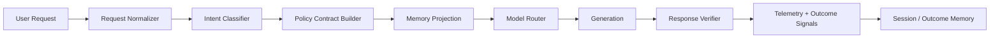

# Quantora Communication Layer Phase 1 Spec

## Objective

Phase 1 should create the smallest real Communication Layer that is:

- typed
- measurable
- safe
- easy to integrate into the current codebase
- capable of improving response quality without destabilizing the Studio

This phase is **not** about launching full autonomous intelligence.
It is about turning the existing conversation system into a formal product subsystem with clear contracts.

## What already exists in the repo

Quantora already has useful foundation pieces:

- `api/_lib/conversation-engine.ts`
- `api/_lib/conversation-policy.ts`
- `api/_lib/session-context.ts`
- `api/_lib/studio-modes.ts`
- `api/_lib/studio-domains.ts`
- `src/lib/model-routing.js`
- `src/lib/outcome-state.js`
- `api/chat.ts`

Phase 1 should **wrap and formalize** these pieces, not replace them all at once.

## Phase 1 scope

Build a pipeline with 5 production modules:

1. intent classification
2. response policy contract
3. model routing contract
4. response evaluation contract
5. typed memory projection

## The Phase 1 pipeline



## Phase 1 deliverables

### 1. Request normalizer

Create:

`api/_lib/communication/request-normalizer.ts`

Purpose:

- normalize incoming request payloads before policy/routing work begins
- produce one stable internal request shape

Type:

```ts
export type CommunicationRequest = {
  message: string;
  sessionId: string | null;
  studioMode: 'ask' | 'build' | 'plan';
  studioDomain: 'travel' | 'finance' | 'education' | 'general' | null;
  taskCategory: 'coding' | 'vision' | 'research' | 'writing' | 'quick' | 'general';
  attachedImages: string[];
  choiceSelected: boolean;
  memoryConsented: boolean;
  sessionContext: SessionContext;
  hasPreviewCode: boolean;
  isRefine: boolean;
  explicitModelId: string | null;
};
```

Current source mappings:

- `api/chat.ts`
  - `message`
  - `sessionId`
  - `studioMode`
  - `studioDomain`
  - `taskCategory`
  - `attachedImages`
  - `choiceSelected`
  - `memoryConsented`
  - `sessionContext`
- `src/components/AiStudio.jsx`
  - `previewCode`
  - refine/build-guided signals

### 2. Intent classifier

Create:

`src/lib/communication/intent/types.ts`  
`src/lib/communication/intent/classifier.ts`

Purpose:

- classify the user’s turn into product-relevant intent metadata

Type:

```ts
export type CommunicationIntent = {
  domain: 'general' | 'travel' | 'education' | 'finance' | 'coding' | 'research';
  mode: 'ask' | 'plan' | 'build' | 'compare' | 'decide' | 'review';
  stakes: 'low' | 'medium' | 'high';
  autonomy: 'answer_only' | 'recommend' | 'draft';
  needsClarification: boolean;
  userGoal: string | null;
};
```

Initial implementation strategy:

- derive from:
  - `normalizeStudioMode`
  - `normalizeStudioDomain`
  - `classifyTask`
  - current build/refine signals
- no model call required in Phase 1
- use model-based classification only in Phase 2 if heuristics are ambiguous

### 3. Policy contract

Create:

`src/lib/communication/policy/response-contract.ts`  
`src/lib/communication/policy/conversation-policy.ts`

Purpose:

- formalize how Quantora should respond before generation

Type:

```ts
export type ResponseContract = {
  action: 'answer' | 'clarify' | 'plan' | 'challenge' | 'recover' | 'refuse';
  tone: 'practical' | 'warm' | 'analytical';
  depth: 'light' | 'standard' | 'deep';
  safetyLevel: 'normal' | 'guarded' | 'high';
  includeMemory: boolean;
  allowBuildArtifact: boolean;
  requireEvidenceFraming: boolean;
};
```

Phase 1 rule:

This contract should be built from existing engine outputs:

- `buildConversationSnapshot(...)`
- `chooseNextConversationMove(...)`
- `formatConversationDecisionForPrompt(...)`

Do **not** duplicate the entire existing conversation engine.
Wrap it.

### 4. Memory projection

Create:

`src/lib/communication/memory/projection.ts`

Purpose:

- decide what memory enters a turn
- separate working context from durable outcome memory

Type:

```ts
export type MemoryProjection = {
  workingContext: SessionContext;
  outcomeFacts: string[];
  userPreferences: string[];
  includeOutcomeMemory: boolean;
  includeConversationContext: boolean;
};
```

Phase 1 behavior:

- only include durable memory if consent exists
- cap total durable facts used per turn
- prefer confirmed facts over inferred facts
- avoid raw transcript replay

Use current building blocks:

- `normalizeSessionContext(...)`
- `readOutcomeState(...)`
- `outcomeStateToConversationContext(...)`

### 5. Model routing contract

Create:

`src/lib/communication/routing/model-router.ts`

Purpose:

- centralize routing decisions independently from UI

Type:

```ts
export type RoutingDecision = {
  primaryModelId: string;
  fallbackModelIds: string[];
  reason: 'speed' | 'vision' | 'quality' | 'build' | 'safety' | 'availability';
};
```

Phase 1 behavior:

- if images exist -> prefer Gemini
- if build/refine mode -> prefer strongest approved build-capable model
- if quick/low-stakes -> prefer fast free model
- if plan/high ambiguity -> allow deeper reasoning model

Use current source logic:

- `chooseBestFreeModel(...)`
- `rankFreeModels(...)`
- image routing inside `AiStudio.jsx`
- approved model enforcement in `api/chat.ts`

Important:

Move routing logic **out of AiStudio** over time.  
In Phase 1, implement the module first and make `AiStudio` call it.

### 6. Response evaluation contract

Create:

`src/lib/communication/evaluation/score-response.ts`

Purpose:

- standardize turn quality signals

Type:

```ts
export type ResponseEvaluation = {
  verifierStatus: 'pass' | 'warning' | 'fail';
  qualitySignal: 'accepted' | 'corrected' | 'abandoned' | 'fallback_rescued' | 'unknown';
  latencyMs: number;
  usedFallback: boolean;
};
```

Current source mappings:

- `verifyConversationResponse(...)`
- `publicConversationMetadata(...)`
- `recordModelQualityEvent(...)`
- explicit user feedback (`helpful`, `not_helpful`)

Phase 1 rule:

- capture response verifier result for every completed turn
- persist fallback rescue explicitly
- distinguish "helpful" from "completed outcome" later in Phase 2

## Exact integration points in the current repo

### A. `api/chat.ts`

This remains the execution spine in Phase 1.

Refactor order:

1. normalize request
2. classify intent
3. build response contract
4. project memory
5. route model
6. generate
7. verify response
8. record telemetry

Target extraction points inside `api/chat.ts`:

- request parsing block
- conversation snapshot block
- system prompt composition
- model selection branch
- response metadata and telemetry block

### B. `src/components/AiStudio.jsx`

This should stop owning routing and behavior policy directly.

Phase 1 changes:

- keep UI state here
- move intent/routing decisions behind imported functions
- remove domain/business-policy branching from the component where possible

What stays in `AiStudio.jsx`:

- rendering
- local interaction state
- attachments UX
- preview orchestration

What starts moving out:

- model selection logic
- build/refine decision logic
- domain response-mode decisions
- fallback policy construction

### C. `src/lib/outcome-state.js`

Keep existing persistence flows, but change the meaning:

- outcome memory becomes one source for Communication Layer memory projection
- it should stop being treated as ad hoc UI state

### D. `api/_lib/conversation-engine.ts`

Keep as the current decision core.

Phase 1 wraps it; Phase 2 may split it into:

- policy
- verification
- action selection

## Phase 1 implementation order

### Step 1 — contracts only

Create the new types and wrapper modules without changing behavior.

Files:

- `request-normalizer.ts`
- `intent/types.ts`
- `response-contract.ts`
- `model-router.ts`
- `score-response.ts`

Goal:

- create the seams
- keep runtime behavior unchanged

### Step 2 — integrate request normalization + intent classification

Wire `api/chat.ts` to use:

- `request-normalizer`
- `intent-classifier`

Goal:

- one stable request shape
- one stable intent object

### Step 3 — wrap the existing conversation engine in a policy contract

Goal:

- turn `chooseNextConversationMove(...)` into a product-facing response contract
- stop spreading policy decisions across multiple files

### Step 4 — centralize routing

Goal:

- create one routing decision object
- make `AiStudio.jsx` consume it instead of constructing model selection itself

### Step 5 — add evaluation outputs

Goal:

- every completed turn produces:
  - verifier result
  - latency
  - fallback usage
  - quality event

## Phase 1 success criteria

Phase 1 is complete when:

1. `api/chat.ts` uses a formal request normalization step
2. each turn has a typed intent object
3. policy decisions are exposed as a response contract
4. routing is centralized behind one module
5. completed turns produce standardized evaluation records
6. `AiStudio.jsx` gets smaller in decision logic, even if not yet fully split

## What not to do in Phase 1

Do **not**:

- add a large new framework
- build a full agent runtime
- introduce model fine-tuning yet
- create autonomous tool execution
- expand into too many domains
- move everything out of `AiStudio.jsx` in one refactor

Phase 1 is about **clean seams and measurable behavior**, not maximum scope.

## Recommended first domain

Use this Phase 1 system first for:

`builder / dream fulfiller`

Why:

- lowest regulatory risk
- best fit for current product
- strongest alignment with the mission
- easiest place to prove "communication intelligence" beyond generic chat

## Example Phase 1 turn flow

User:

> I want to build an app that helps students learn calculus visually.

Pipeline:

1. request normalized
2. intent classified:
   - domain: education
   - mode: build
   - stakes: medium
   - autonomy: draft
3. policy contract built:
   - action: clarify
   - tone: warm
   - depth: standard
   - allowBuildArtifact: false
4. memory projection:
   - include preference for concise guidance
   - include prior accepted learning-style facts
5. model routed:
   - primary: Gemini Flash
   - fallback: approved stronger reasoning model
6. response generated
7. verifier checks whether the answer matched policy
8. telemetry records latency, helpfulness path, and whether the user proceeded

That is a real Communication Layer turn.

## Immediate next implementation target

The first code task should be:

**create the typed contracts and wrapper modules without changing current behavior**

That lets Quantora evolve safely and incrementally instead of attempting another large refactor.
